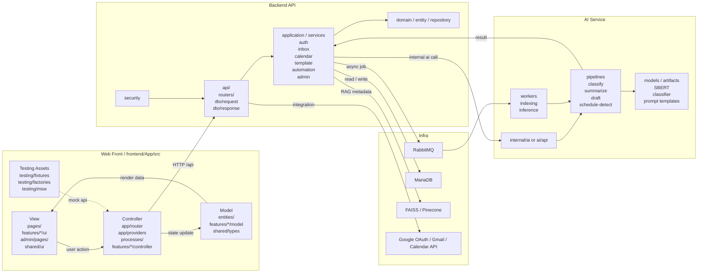

# EmailAssist 통합 설계 문서

이 문서는 EmailAssist의 서비스 구조, 화면 흐름, 데이터, API, AI, 인프라를 하나의 설계서로 정리한 문서다. 제공된 설계서 목차 체계를 그대로 따르며, 요구사항과 설계 원칙을 기준으로 목표 서비스 구조를 정리한다.

문서 내 표기 규칙은 다음과 같다.

- `확정 정보`: 요구사항 문서와 설계 원칙으로 합의된 내용
- `임시 작성`: 세부안 확정을 위해 제안하는 기본 설계. 이후 조정 가능
- `추가 정보 필요`: 최종 설계 확정 전에 사용자 또는 팀 의사결정이 더 필요한 항목
- 문서 간 충돌이나 추가 확인이 필요한 내용은 별도 충돌 검토 문서와 이 문서의 `추가 정보 필요` 항목을 함께 본다.

## 1. 프로젝트 개요

### 1.1 개발목표와 범위

**확정 정보**

EmailAssist는 기업 업무 이메일을 자동 분류하고, 기업 문맥과 템플릿을 기반으로 회신 초안을 생성하며, 일정 관련 메일은 캘린더 등록까지 연결하는 AI 기반 이메일 자동화 서비스다.

핵심 목표는 다음과 같다.

- 업무 메일의 `Domain + Intent` 2-depth 분류 자동화
- 메일 요약, 엔터티 추출, 일정 후보 탐지
- 반동적 템플릿과 기업 문맥을 결합한 답장 초안 생성
- 사용자 승인 기반 일정 등록
- 사용자 앱과 관리자 콘솔을 분리한 운영 구조 제공

서비스 범위는 아래와 같다.

| 영역        | 목적                               | 주요 내용                                     |
| ----------- | ---------------------------------- | --------------------------------------------- |
| 사용자 앱   | 실사용자 메일 처리와 승인 흐름     | 수신함, 일정, 템플릿, 자동화, 프로필, 설정    |
| 관리자 콘솔 | 운영 및 검수                       | 대시보드, 회원, 템플릿, 문의 대응             |
| 백엔드 API  | 인증, 저장, 외부 연동, 서비스 조율 | Gmail/Calendar 연동, REST API, 워커 조율      |
| AI 서비스   | 분류, 요약, 엔터티, 초안 생성      | Domain/Intent 분류, RAG, 일정 추출, 초안 생성 |
| 설계 문서   | 서비스 기준과 개발 컨텍스트 정리   | 아키텍처, 에이전트 컨텍스트, 충돌 검토 문서   |

**임시 작성**

전체 서비스가 완성되면 다음 범위를 포함하는 것으로 가정한다.

- 사용자 인증 및 Google 계정 연동
- Gmail 수집 및 분석 결과 저장
- 관리자 운영 지표와 승인 플로우
- AI 추론 서버와 비동기 메시지 브로커

**추가 정보 필요**

- 실제 서비스 출시 범위가 `웹 only`인지, 추후 모바일 앱이 별도로 필요한지
- 관리자 콘솔의 최종 제품 범위가 어느 수준까지 필요한지
- 온프레미스, 하이브리드, 클라우드 중 최종 운영 환경 기준

### 1.2 개발일정 / 산출물

**확정 정보**

프로젝트는 서비스 설계, 화면 정의, API/DB 명세, AI 파이프라인 정의를 단계적으로 산출하는 것을 목표로 한다.

주요 산출 목표는 다음과 같다.

- 사용자 앱 화면 설계와 사용자 흐름 정의
- 관리자 콘솔 화면 설계와 운영 흐름 정의
- 통합 설계 문서
- 개발 핸드오프 문서
- 충돌 및 후속 정보 요청 문서

**임시 작성**

실행 관점의 단계는 아래처럼 가정한다.

| 단계  | 목적                          | 산출물                                          |
| ----- | ----------------------------- | ----------------------------------------------- |
| 1단계 | 서비스/화면/문서 기준 확정    | 통합 설계 문서, 개발 핸드오프 문서, 화면 설계안 |
| 2단계 | 백엔드/AI 인터페이스 확정     | REST API, 내부 AI API, DB 설계                  |
| 3단계 | 사용자 앱 서비스 연동         | 사용자 앱 API 연동, 메일/일정 처리 흐름         |
| 4단계 | 관리자 콘솔 범위 확정 및 연동 | 운영 기능 정의, 관리자 API 연동                 |
| 5단계 | AI 학습/평가/운영 지표 도입   | 모델 아티팩트, 성능 지표, 운영 로그             |

**추가 정보 필요**

- 실제 마일스톤 날짜
- 역할별 담당자와 리뷰 프로세스
- 베타/운영 전환 기준

### 1.3 개발조직 / 역할

**확정 정보**

역할은 다음과 같이 분리된다.

| 역할       | 책임                                                            |
| ---------- | --------------------------------------------------------------- |
| 프론트엔드 | 사용자 앱과 관리자 콘솔 UI, 상태 관리, 화면 흐름, API 연동      |
| 백엔드     | 인증, Gmail/Calendar 연동, 저장, 관리자 API, 메시지 브로커 조율 |
| AI         | 데이터셋 구축, 분류기, 요약/엔터티 추출, RAG, 초안 생성         |
| 인프라     | 네트워크, 스토리지, 브로커, 배포, 보안 정책                     |

**임시 작성**

협업 방식은 아래처럼 가정한다.

- 프론트엔드는 사용자 앱의 서비스 연동을 우선한다.
- 관리자 콘솔은 요구사항이 정리되기 전까지 정보구조 참고용 기본안으로 유지한다.
- 백엔드는 프론트가 기대하는 공개 API와 AI 내부 API의 중간 조율 계층을 담당한다.
- AI는 독립 서비스 또는 내부 워커 구조를 취할 수 있다.

**추가 정보 필요**

- 관리자 콘솔 소유 팀과 승인 프로세스
- 백엔드와 AI를 한 팀이 담당하는지, 분리된 팀이 담당하는지
- 운영 모니터링과 감사 로그의 소유 주체

## 2. 요구사항 정의

### 2.1 서비스 구성 및 개요

**확정 정보**

EmailAssist는 아래 계층으로 구성된다.

| 구성요소      | 역할                                                       |
| ------------- | ---------------------------------------------------------- |
| 사용자 앱     | 메일 조회, 초안 검토, 일정 승인, 템플릿/설정 관리          |
| 관리자 콘솔   | 운영 지표, 회원/템플릿/문의 관리                           |
| 백엔드 API    | 인증, 저장, 외부 연동, AI 요청/응답 조율                   |
| AI 서비스     | 분류, 요약, 엔터티 추출, RAG, 초안 생성                    |
| 데이터 저장소 | MariaDB 기반 서비스 데이터 저장, 운영 로그 저장            |
| 외부 서비스   | Google OAuth, Gmail API, Google Calendar API, 외부 LLM API |

주요 서비스 진입 경로와 채널은 다음과 같이 설계한다.

- 사용자 앱 라우트: `/`, `/app`, `/app/inbox`, `/app/calendar`, `/app/templates`, `/app/automation`, `/app/profile`, `/app/settings`, `/app/onboarding`
- 관리자 콘솔 라우트: `/`, `/members`, `/templates`, `/inquiries`
- 서비스 API: `/api/*`
- AI 내부 API: `/internal/ai/*`

**임시 작성**

완성형 서비스의 상위 흐름은 다음으로 가정한다.

1. 사용자가 서비스 로그인 후 Google 계정을 연동한다.
2. Gmail 신규 메일이 백엔드에 유입된다.
3. 메일 원문과 정제본이 저장된다.
4. 백엔드가 AI 서비스에 분석을 위임한다.
5. AI 결과가 저장되고 사용자 앱에 노출된다.
6. 사용자가 초안 발송이나 일정 승인 액션을 수행한다.

**추가 정보 필요**

- 사용자 인증이 자체 계정 + Google 연동인지, Google SSO만 허용하는지
- 멀티테넌시 구조가 필요한지
- 조직/부서 개념이 실제 제품 필수인지

### 2.2 AI 데이터분석의 요구사항

**확정 정보**

AI 데이터분석은 다음을 처리해야 한다.

- 업무 관련 메일 분류
- 메일 핵심 내용 요약
- 답장 초안 생성
- 일정 정보 추출

기본 분류 체계는 다음과 같다.

| Domain           | Intent                                                                                    |
| ---------------- | ----------------------------------------------------------------------------------------- |
| Sales            | 견적 요청, 계약 문의, 가격 협상, 제안서 요청, 미팅 일정 조율                              |
| Marketing & PR   | 협찬/제휴 제안, 광고 문의, 보도자료 요청, 인터뷰 요청, 콘텐츠 협업 문의, 행사/캠페인 문의 |
| HR               | 채용 문의, 면접 일정 조율, 휴가 신청, 증명서 발급 요청                                    |
| Finance          | 세금계산서 요청, 비용 처리 문의, 입금 확인 요청, 정산 문의                                |
| Customer Support | 불만 접수, 기술 지원 요청, 환불 요청, 사용법 문의                                         |
| IT/Ops           | 시스템 오류 보고, 계정 생성 요청, 권한 변경 요청                                          |
| Admin            | 공지 전달, 내부 보고, 자료 요청, 협조 요청                                                |

분석 단위는 `email_text = subject + body_clean`을 기준으로 한다.

**임시 작성**

분석 결과는 아래 항목을 모두 포함하는 것이 바람직하다.

- `domain`
- `intent`
- `domain_confidence`
- `intent_confidence`
- `summary`
- `entities`
- `schedule_candidate`
- `draft_reply`

**추가 정보 필요**

- 실제 운영에서 도메인 수와 인텐트 수를 고정할지, 고객사별 커스터마이즈를 허용할지
- 다국어 메일을 지원해야 하는지
- 첨부파일 본문 추출까지 AI 입력 범위에 포함할지

### 2.3 AI 학습서버의 요구사항

**확정 정보**

AI 학습/추론 서버는 다음 요구사항을 충족해야 한다.

- SBERT 모델과 분류기 artifact 로드
- Domain 분류와 Domain 조건부 Intent 분류
- confidence 기반 low-confidence 판정
- Top-2 Domain 후보 반환
- 요약, 엔터티 추출, 초안 생성
- RAG 기반 문맥 검색

**임시 작성**

학습서버는 다음 경계를 가진 별도 서비스라고 가정한다.

- 입력: 메일 본문, 제목, 사용자 프로필, 템플릿 정보, 자료 인덱스
- 출력: 분류 결과, 요약, 엔터티, 일정 후보, 초안
- 부가 기능: 템플릿 재생성, 자료 인덱싱, 상태 확인

**추가 정보 필요**

- 학습과 추론을 같은 서비스로 운영할지 분리할지
- GPU가 필요한 단계와 CPU만으로 가능한 단계의 분리 여부
- 모델 버전 관리와 롤백 정책

### 2.4 AI 서비스 유스케이스 모델

**확정 정보**

주요 액터와 유스케이스는 다음과 같다.

| 액터          | 유스케이스                                 |
| ------------- | ------------------------------------------ |
| 사용자        | 메일 결과 확인, 초안 검토, 발송, 일정 승인 |
| 관리자        | 운영 지표 확인, 회원/템플릿/문의 관리      |
| 백엔드        | Gmail 수집, 정제, 저장, AI 요청            |
| AI            | 분류, 요약, 엔터티 추출, 초안 생성         |
| Google 서비스 | 메일/일정 외부 연동                        |

**임시 작성**

핵심 AI 유스케이스는 다음과 같다.

1. 신규 메일 분석
2. 일정 후보 탐지
3. 사용자 프로필 기반 초안 생성
4. 자료 변경 시 템플릿 재생성
5. low-confidence 결과의 수동 검토 대상 분리

**추가 정보 필요**

- low-confidence 메일을 프론트에서 어떻게 보여줄지
- 관리자 승인 대상이 템플릿만인지, 메일 분류 규칙까지 포함하는지

### 2.5 요구기능 정의 (모바일 / 웹 사용자용)

**확정 정보**

사용자 앱은 웹 기반 반응형 인터페이스를 기본으로 설계하며, 모바일에서도 핵심 흐름을 유지한다.

#### 예정 라우트와 설계 범위

| 경로              | 화면              | 핵심 기능                                          |
| ----------------- | ----------------- | -------------------------------------------------- |
| `/`               | 초기 설정         | 계정 연결, 비즈니스 설정, 자료 입력, 카테고리 설정 |
| `/app`            | 대시보드          | 처리량 요약, 일정, 최근 메일, 주간 통계            |
| `/app/inbox`      | 수신함            | 메일 목록, 분석 결과, 초안 검토, 발송 액션         |
| `/app/calendar`   | 캘린더            | 일정 생성, 수정, 무시, 메일 기반 일정 승인         |
| `/app/templates`  | 템플릿 라이브러리 | 검색, 필터, 템플릿 조회/관리                       |
| `/app/automation` | 자동화 설정       | 카테고리 규칙, 자동 발송, 캘린더 연동              |
| `/app/profile`    | 비즈니스 프로필   | 업종, 어조, 자료, FAQ, 템플릿 재생성 요청          |
| `/app/settings`   | 설정              | 계정, 알림, 화면, 이메일 연동, 관리자 문의         |
| `/app/onboarding` | 온보딩 위저드     | 초기 설정 재실행, 카테고리/자료/템플릿 기준 설정   |

#### 사용자 앱 주요 화면 설계

1. **초기 설정 `/`**
   - 이메일 계정 연결을 시작점으로 둔다.
   - UI의 `업종 / 비즈니스 유형` 선택지는 내부 `Domain` 목록에 대응하며, 화면에는 `한글 (영문)` 형식으로 표시한다.
   - 선택한 업종 / 비즈니스 유형에 해당하는 카테고리는 기본 등록되며, 다른 업종의 추천 카테고리 추가와 임의 카테고리 입력도 허용한다.
   - 설명, 어조, 업로드 파일, FAQ를 입력받아 비즈니스 컨텍스트를 구성한다.
   - 템플릿 생성 진행 상태와 결과 반영 흐름을 제공한다.

2. **대시보드 `/app`**
   - 상단 카드: 처리 이메일 수, 검토 대기 초안, 템플릿 매칭률, 계정 상태
   - 다가오는 일정 목록
   - 최근 수신 이메일 목록
   - 이번 주 요약 차트

3. **수신함 `/app/inbox`**
   - 상태 탭: `all | pending | completed | auto-sent`
   - 3패널 구조: 메일 목록, 본문, 초안
   - 액션: 발송, 편집 후 발송, 건너뛰기
   - 일정 감지 카드에서 캘린더로 `prefillEvent`를 전달한다.

4. **캘린더 `/app/calendar`**
   - 인박스에서 전달한 `prefillEvent`를 받아 자동 추가 또는 수정 후 추가한다.
   - `confirmed` 불리언으로 확정 여부를 표현한다.
   - 생성/수정/삭제 액션은 일정 API 및 Calendar 연동과 연결한다.

5. **템플릿 라이브러리 `/app/templates`**
   - 카테고리, 검색어, confidence, 최근 수정 여부로 필터링한다.
   - 템플릿 상세는 프리뷰/모달 기반이다.
   - 템플릿 생성, 수정, 삭제, 승인 상태 조회를 지원한다.

6. **자동화 설정 `/app/automation`**
   - 카테고리 규칙은 `id/name/keywords/template/autoSend/color` 구조다.
   - 캘린더 연결 상태와 자동 등록 카테고리를 관리한다.
   - 규칙 기반 자동화와 AI 분류 결과 기반 자동화를 함께 수용할 수 있어야 한다.

7. **비즈니스 프로필 `/app/profile`**
   - 업종, 설명, 어조, 업로드 파일, FAQ를 관리한다.
   - 템플릿 재생성 요청과 진행 상태 조회를 지원한다.

8. **설정 `/app/settings`**
   - 탭 구조: `account`, `notifications`, `display`, `email`, `support`
   - 연결된 이메일 계정 목록과 연동 상태를 조회·변경한다.
   - 관리자 문의는 `SupportTickets` 구조(`title`, `content`, `status`, `admin_reply`)를 기준으로 목록, 상세, 답변 확인 흐름을 제공한다.

#### 사용자 앱 핵심 데이터 모델

`EmailItem`

| 필드                               | 의미                                |
| ---------------------------------- | ----------------------------------- |
| `id`                               | 이메일 식별자                       |
| `sender`, `senderEmail`, `company` | 발신자 정보                         |
| `subject`, `preview`, `body`       | 메일 내용                           |
| `time`, `receivedDate`             | 표시용 시각                         |
| `category`                         | 사용자 앱 표시용 카테고리           |
| `status`                           | `pending \| completed \| auto-sent` |
| `schedule`                         | 일정 감지 여부와 세부 정보          |
| `draft`                            | 생성된 답장 초안                    |

`CalendarEvent`

| 필드                                          | 의미                                   |
| --------------------------------------------- | -------------------------------------- |
| `id`, `title`, `date`, `startTime`, `endTime` | 일정 기본 정보                         |
| `type`                                        | `meeting \| call \| video \| deadline` |
| `attendees`                                   | 참석자 배열                            |
| `fromEmail`                                   | 원본 메일 연계 정보                    |
| `confirmed`                                   | 사용자 승인 또는 확정 여부             |

**임시 작성**

사용자 앱은 아래 공개 API와 연계하는 것을 기본안으로 둔다.

- 인증/로그인
- 메일 목록/상세/초안 조회
- Gmail 발송
- Google Calendar 등록/수정/무시
- low-confidence 및 AI 오류 상태 노출
- 자료 업로드와 템플릿 재생성 상태 표시

**추가 정보 필요**

- `/`를 최종적으로 로그인 페이지로 둘지, 설정 위저드로 둘지
- 사용자 앱에서 조직/팀 개념을 노출할지
- 초안 편집기가 단순 텍스트인지 리치 텍스트인지

### 2.6 요구기능 정의 (웹 관리자용)

**확정 정보**

관리자 콘솔은 아래 라우트를 기준으로 설계한다.

| 경로         | 목적          |
| ------------ | ------------- |
| `/`          | 운영 대시보드 |
| `/members`   | 회원 관리     |
| `/templates` | 템플릿 관리   |
| `/inquiries` | 문의 대응     |

**임시 작성**

관리자 콘솔 기본안은 아래 범위를 포함한다.

- 운영 대시보드: 처리량, 도메인 분포, 파이프라인 상태
- 회원 관리: 검색, 활동 요약, 계정 상태
- 템플릿 관리: 도메인별 목록, 승인 대기, 품질 지표
- 문의 대응: 문의 상태와 관리자 답변

이 구성은 제품 요구사항 최종 확정 전까지 기본안으로 유지한다.

**추가 정보 필요**

- 관리자 콘솔이 실제 제품 범위에 포함되는지
- 관리자 권한 체계와 역할 종류
- 시스템 운영 모니터링 메뉴를 포함할지

## 3. 데이터 분석 및 전처리

### 3.1 데이터 수집 출처 및 수집방법

**확정 정보**

데이터 수집 출처는 다음과 같다.

| 출처               | 방식                 | 용도                   |
| ------------------ | -------------------- | ---------------------- |
| Gmail 원문 메일    | Gmail API 조회       | 운영 데이터, 분석 입력 |
| 사용자 입력 프로필 | 프론트 입력 후 저장  | 초안 품질 개선         |
| 업로드 파일        | PDF/DOCX/TXT 등      | RAG 자료               |
| FAQ 입력           | 텍스트 직접 입력     | RAG 자료               |
| 합성 데이터셋      | LLM 생성 후 CSV 저장 | 분류 모델 학습         |

메일 전처리 기본 흐름:

1. `messages.get(format=full)`로 메일 상세 조회
2. 헤더 추출: `From`, `To`, `Cc`, `Subject`, `Date`, `Message-ID`
3. 본문 선택: `text/plain` 우선, 없으면 `text/html`
4. base64url 디코딩
5. HTML/서명/인용문 제거
6. `body_raw`, `body_clean` 저장

첨부파일은 조회 시점에 메타데이터만 취급하고 실제 다운로드는 사용자 요청 시점에 수행한다.

**임시 작성**

첨부파일 처리 흐름은 아래와 같은 방식으로 적용하는 것을 기준으로 둔다.

- 메일 조회 시 첨부파일명, `attachmentId`, 메일 ID만 저장
- 사용자가 클릭하면 백엔드 다운로드 API를 호출
- 백엔드가 Gmail Attachment API에서 원본을 가져와 디코딩 후 응답

**추가 정보 필요**

- 첨부파일을 별도 스토리지에 영구 저장할지
- 개인정보/민감정보 마스킹 정책
- Gmail Push Pub/Sub과 폴링 중 최종 수집 방식

### 3.2 데이터 특징추출 및 특징분포

**확정 정보**

기본 특징은 아래를 사용한다.

- `subject`
- `body_clean`
- `email_text = subject + body_clean`
- 발신자 이름
- 발신자 회사
- 발신자 부서
- 날짜/시간/마감 표현

분포 설계 원칙:

- Domain 7종, Intent 30종
- 일정 관련 intent에는 날짜/시간 표현 포함
- 한국어 비즈니스 메일 문체 유지
- 다양한 문장 구조와 일정 표현 사용

**임시 작성**

운영 단계에서는 추가 특징도 고려할 수 있다.

- 스레드 길이
- 첨부파일 유무
- 발신 도메인 신뢰도
- 업종/도메인 온보딩 정보

**추가 정보 필요**

- 고객사별 custom category를 학습 라벨에 포함할지
- importance/priority 필드를 AI가 직접 산출할지

### 3.3 데이터세트 정의 및 생성

**확정 정보**

초기 데이터셋 구조는 다음을 기준으로 한다.

```text
subject
body
email_text
sender_name
sender_company
sender_department
domain
intent
```

Intent당 목표 데이터 규모는 40개 메일이다.

**임시 작성**

데이터 생성 절차는 다음으로 둔다.

1. Domain/Intent별 합성 이메일 JSON 생성
2. 형식 검수
3. CSV 변환
4. 학습/검증/평가셋 분할

**추가 정보 필요**

- 실데이터 라벨링을 병행할지
- 고객사 실제 메일을 익명화해서 사용할 수 있는지

## 4. AI 학습모델의 설계

### 4.1 모델 파이프라인의 구성

**확정 정보**

추론 파이프라인은 아래 순서를 따른다.

1. 메일 입력 수신
2. 본문 정제
3. SBERT 임베딩 생성
4. Domain 분류
5. Domain 조건부 Intent 분류
6. confidence 계산
7. Top-2 Domain 후보 반환
8. 요약 생성
9. 엔터티 추출
10. 일정 후보 판단
11. 템플릿 매칭
12. RAG 검색
13. 최종 초안 보정

**임시 작성**

기본 결과 구조는 아래로 둔다.

```json
{
  "domain": "Sales",
  "domain_confidence": 0.94,
  "intent": "견적 요청",
  "intent_confidence": 0.91,
  "low_confidence": false,
  "top2_domains": [
    { "domain": "Sales", "confidence": 0.94 },
    { "domain": "Marketing & PR", "confidence": 0.03 }
  ],
  "summary": "엔터프라이즈 플랜 가격과 일정 가능 시간을 문의한 메일",
  "entities": {
    "customer_name": "박민수",
    "company": "(주)테크솔루션",
    "date": "2026-03-04",
    "time": "14:00"
  },
  "schedule_candidate": {
    "detected": true,
    "title": "테크솔루션 엔터프라이즈 플랜 상담"
  },
  "draft_reply": {
    "subject": "Re: 엔터프라이즈 플랜 가격 문의",
    "body": "..."
  }
}
```

**추가 정보 필요**

- summary와 draft를 같은 모델 호출에서 만들지 분리할지
- 일정 후보가 여러 개인 경우 응답 형태

### 4.2 AI 학습 알고리즘 선정

**확정 정보**

본 문서 기준 기본안은 다음과 같다.

| 단계             | 기본안                                  |
| ---------------- | --------------------------------------- |
| 임베딩           | `paraphrase-multilingual-MiniLM-L12-v2` |
| Domain 분류      | Logistic Regression                     |
| Intent 분류      | Domain별 Logistic Regression            |
| 요약/엔터티 추출 | 외부 LLM API                            |
| 최종 초안 생성   | 외부 LLM API + 템플릿 + RAG             |
| 벡터 검색        | FAISS                                   |

**임시 작성**

알고리즘 선정 이유는 아래로 둔다.

- 임베딩/분류는 비용 효율성과 응답 속도 우선
- 자연어 생성은 외부 LLM 활용
- 벡터 검색은 온프레미스 우선이므로 FAISS 기본

**추가 정보 필요**

- 외부 LLM 공급자를 단일 공급자로 고정할지
- Pinecone를 실제 운영에 도입할 필요가 있는지

### 4.3 AI 학습 파라미터 설정

**확정 정보**

현재 확인 가능한 추론 파라미터는 다음과 같다.

- SBERT 인코딩 시 `normalize_embeddings=True`
- `CONFIDENCE_THRESHOLD` 기준 low-confidence 판정
- Top-2 Domain 반환
- 온보딩에서 Domain 정보가 있으면 Domain 분류를 건너뛸 수 있음

**임시 작성**

운영 초기 파라미터 정책은 아래로 둔다.

- Domain confidence와 Intent confidence 둘 다 threshold 평가
- threshold 미만이면 수동 검토 대상
- 모델 버전은 응답과 저장 데이터에 포함

**추가 정보 필요**

- threshold 초기값
- 업종/회사별 별도 모델이 필요한지

### 4.4 AI 학습 모델의 생성

**확정 정보**

모델 생성 절차는 다음과 같다.

1. 학습 CSV 준비
2. `email_text` 임베딩 생성
3. Domain 분류기 학습
4. Domain별 Intent 분류기 학습
5. Label Encoder와 모델 artifact 저장
6. 검증셋 평가

**임시 작성**

artifact 저장물:

- SBERT model path
- Domain classifier
- Domain label encoder
- Intent classifier map
- Intent label encoder map

**추가 정보 필요**

- 모델 저장 위치
- 주기적 재학습 여부

## 5. (UI)화면설계

### 5.1 사용자 메뉴구성

**확정 정보**

현재 사용자 메뉴는 아래와 같다.

| 메뉴             | 목적                               |
| ---------------- | ---------------------------------- |
| Dashboard        | 처리량, 일정, 최근 메일, 주간 요약 |
| Inbox            | 메일 목록, 본문, 초안              |
| Calendar         | 일정 확인/추가/수정                |
| Templates        | 템플릿 검색/관리                   |
| Automation       | 카테고리 규칙과 캘린더 연결        |
| Business Profile | 비즈니스 정보, 자료, FAQ           |
| Settings         | 계정/알림/표시/이메일 계정         |
| Onboarding       | 초기 설정 위저드                   |

### 5.2 초기화면 (로그인 전) 화면설계

**확정 정보**

`/` 진입 화면은 로그인 전 초기 설정 또는 로그인 이전 안내 흐름을 포함하는 화면으로 설계한다.

초기 진입 화면은 다음 요소를 포함한다.

- 이메일 계정 연결
- 비즈니스 유형, 어조, 설명 입력
- 파일 업로드
- FAQ 추가
- 기본 카테고리 수정
- 템플릿 생성 진행 UI

**임시 작성**

최종 서비스에서는 로그인 전 화면이 아래 두 가지 중 하나여야 한다.

1. 랜딩 + 로그인/회원가입
2. 초대 기반 서비스라면 로그인 후 바로 설정 위저드

**추가 정보 필요**

- 이메일/비밀번호 로그인 필요 여부
- 회원가입 정책
- Google OAuth를 로그인과 메일 연동에 동시에 사용할지

### 5.3 사용자 화면설계 (웹 / 모바일)

**확정 정보**

#### Dashboard

- 경로: `/app`
- 데이터: 이메일 처리량, 일정 목록, 최근 메일 요약, 주간 통계
- 구성: 카드, 일정 리스트, 최근 메일 리스트, 주간 분포 차트

#### Inbox

- 경로: `/app/inbox`
- 데스크톱: 3컬럼 레이아웃
- 모바일: 목록/상세 전환 구조
- 메일 상태값: `pending`, `completed`, `auto-sent`
- 초안 패널은 템플릿명과 토큰 강조 표시를 포함
- 일정 감지 시 캘린더 추가/수정 후 추가/무시 액션 제공

#### Calendar

- 경로: `/app/calendar`
- 월간 캘린더 + 상세 사이드바
- 인박스에서 `prefillEvent`를 받아 일정 생성
- 생성/수정/삭제 액션은 일정 API와 Calendar 연동을 통해 처리

#### Templates

- 경로: `/app/templates`
- 검색, 카테고리 필터, confidence 필터, 최근 수정 필터 제공
- 생성/수정/삭제 모달 존재

#### Automation

- 경로: `/app/automation`
- 카테고리 규칙 CRUD
- 자동 발송 토글
- 캘린더 연결 on/off
- 자동 등록 카테고리 선택

#### Business Profile

- 경로: `/app/profile`
- 업종, 설명, 어조 입력
- 파일 목록과 FAQ CRUD
- 재생성 대상 템플릿 선택 후 재생성 시뮬레이션

#### Settings

- 경로: `/app/settings`
- 탭: 계정, 알림, 표시, 이메일, 관리자 문의
- 연결된 이메일 계정 목록과 수동 추가/해제 UI
- 관리자 문의 목록, 상세, 답변 확인 UI

**임시 작성**

모든 사용자 화면은 최종적으로 아래 API 연동이 필요하다.

- 대시보드 요약 API
- 수신함 목록/상세 API
- 발송/건너뛰기 API
- 일정 등록 API
- 템플릿 CRUD API
- 자동화 규칙 API
- 비즈니스 프로필/자료/FAQ API
- 설정 및 연동 상태 API

**추가 정보 필요**

- 모바일 전용 화면 요구사항
- 에디터 편집 UX
- 템플릿 변수 입력 UX

### 5.4 관리자 메뉴구성

**확정 정보**

관리자 콘솔 기본 메뉴는 아래와 같다.

| 메뉴      | 목적                        |
| --------- | --------------------------- |
| Dashboard | 운영 지표와 파이프라인 요약 |
| Members   | 사용자/계정 관리            |
| Templates | 템플릿 검수와 품질 관리     |
| Inquiries | 문의 대응                   |

**임시 작성**

제품 요구사항이 확정되면 아래 구성을 유지하는 방향이 자연스럽다.

- Dashboard
- Members
- Templates
- Inquiries
- 선택적: System Monitoring

**추가 정보 필요**

- 관리자 메뉴를 이 구조로 확정할지
- 감사 로그와 시스템 모니터링을 포함할지

### 5.5 관리자 화면설계 (웹)

**확정 정보**

관리자 화면은 운영과 검수 중심 흐름을 기준으로 설계한다.

#### Dashboard

- 도메인별 메일 비율
- 하루 처리량
- 부서별 사용량
- 메시지 파이프라인 상태 카드

#### Templates

- 도메인 필터
- 정확도/버전/상태/승인 컬럼
- 승인 대기 테이블
- 생성/일괄 승인 액션

**임시 작성**

Members와 Inquiries는 아래 수준으로 정리한다.

- Members: 사용자 목록, 검색, 상태, 활동 요약
- Inquiries: 문의 목록, 상태, 상세, 답변 작성

운영 모니터링, 감사 로그, 권한 관리 세부 메뉴는 필요 시 확장한다.

**추가 정보 필요**

- 관리자 상세 화면의 실제 필수 필드
- 승인/권한 변경 액션 허용 범위

## 6. 프로세스(기능) 설계

### 6.1 시스템 아키텍쳐

**확정 정보**

서비스의 논리 아키텍처는 아래와 같다.

```text
User Frontend
Admin Frontend
        |
        v
   Backend API
        |
        +--> MariaDB
        +--> Gmail API / Google Calendar API / Google OAuth
        +--> RabbitMQ
                |
                v
             AI Service
                |
                +--> SBERT / Classifier
                +--> FAISS
                +--> External LLM API
```

네트워크 기본안은 다음과 같다.

| 영역     | 대역             | 역할               |
| -------- | ---------------- | ------------------ |
| 외부망   | Public IP        | 사용자 접근        |
| VPN 구간 | `192.168.0.0/24` | 내부 접근 통제     |
| DMZ      | `192.168.1.0/24` | Jump Server, Proxy |
| 서비스망 | `192.168.2.0/24` | 백엔드/API         |
| DB망     | `192.168.3.0/24` | MariaDB            |
| AI망     | `10.0.1.0/24`    | AI 서버            |

**임시 작성**

배포 원칙:

- 앱과 데이터는 온프레미스 우선
- AI 연산만 AWS 보조 사용 가능
- 외부 LLM 사용 시 최소 필드만 전송

**추가 정보 필요**

- 실제 DMZ/VPN 구성이 필수인지
- Kubernetes 사용 여부

### 6.2 사용자 기능설계 (Sequence Diagram)

**확정 정보**

#### 신규 메일 분석

```text
Gmail -> Backend: 새 메일 이벤트
Backend -> Gmail API: 메시지 상세 조회
Backend -> Storage: 원문/정제본 저장
Backend -> RabbitMQ: 분석 요청
AI -> RabbitMQ: 요청 consume
AI -> Backend: 분석 결과 반환
Backend -> Storage: 결과 저장
Frontend -> Backend: 메일 목록/상세 조회
Backend -> Frontend: 메일 + 분석 결과 + 초안 응답
```

#### 답장 발송

```text
사용자 -> Frontend: 발송 또는 편집 후 발송
Frontend -> Backend: reply 액션 요청
Backend -> Gmail API: 메일 발송
Backend -> Storage: 초안/메일 상태 업데이트
Backend -> Frontend: 완료 응답
```

#### 일정 승인

```text
사용자 -> Frontend: 일정 등록 클릭
Frontend -> Backend: calendar 액션 요청
Backend -> Google Calendar API: 이벤트 생성 또는 무시 처리
Backend -> Storage: CalendarEvents 상태 업데이트
Backend -> Frontend: 완료 응답
```

**임시 작성**

low-confidence 메일은 다음 흐름을 둘 수 있다.

```text
AI -> Backend: low_confidence=true
Backend -> Frontend: 수동 검토 필요 상태 노출
사용자 -> Frontend: 분류/초안 검토
```

**추가 정보 필요**

- 저신뢰도 메일에 대한 사용자 보정 기능 필요 여부

### 6.3 관리자 기능설계 (Sequence Diagram)

**확정 정보**

관리자 기능은 아래 시퀀스를 기준으로 설계한다.

**임시 작성**

#### 템플릿 승인 대기 확인

```text
관리자 -> Admin Frontend: 템플릿 페이지 진입
Admin Frontend -> Backend: 승인 대기 목록 요청
Backend -> Storage: 템플릿/지표 조회
Backend -> Admin Frontend: 목록 응답
```

#### 문의 답변

```text
관리자 -> Admin Frontend: 문의 상세 진입
Admin Frontend -> Backend: 문의 상세 조회
Backend -> Storage: SupportTickets 조회
관리자 -> Admin Frontend: 답변 작성
Admin Frontend -> Backend: 답변 저장
Backend -> Storage: 답변/상태 업데이트
```

**추가 정보 필요**

- 관리자 승인 대상이 템플릿만인지, 자동화 규칙도 포함하는지
- 회원 상태 변경 권한 필요 여부

### 6.4 AI 학습서버 기능설계

**확정 정보**

AI 서비스 기능은 다음 네 묶음으로 구분된다.

| 묶음 | 기능                                     |
| ---- | ---------------------------------------- |
| 분류 | SBERT 임베딩, Domain/Intent 분류         |
| 생성 | 요약, 엔터티 추출, 초안 생성             |
| 검색 | RAG 인덱싱, top-k retrieval              |
| 운영 | 헬스체크, 모델 버전, low-confidence 판정 |

**임시 작성**

처리 입력:

- `email_id`
- `user_id`
- `subject`
- `body_clean`
- `email_text`
- `user_domain` 또는 업종 정보
- 비즈니스 프로필
- 자료 검색 컨텍스트

**추가 정보 필요**

- 배치 분석 API 필요 여부
- 자료 인덱싱을 실시간 처리할지 배치 처리할지

## 7. API 설계

### 7.1 서버 / 클라이언트 구조

**확정 정보**

API는 아래 세 계층으로 본다.

| 계층                 | 역할                              |
| -------------------- | --------------------------------- |
| Frontend Public API  | 사용자 앱과 관리자 콘솔이 호출    |
| Backend Internal API | 서비스 내부 모듈 간 사용          |
| AI Internal API      | 백엔드가 호출하는 분석/인덱싱 API |

REST 원칙:

- 로그인 사용자 기준은 `/me`
- 리소스명은 복수형 우선
- 조회 `GET`, 생성 `POST`, 부분 수정 `PATCH`, 삭제 `DELETE`
- 업서트/전체 저장 성격은 `PUT` 허용

### 7.2 REST API 서비스 정의

**확정 정보**

주요 API 그룹은 다음과 같다.

| 그룹             | 엔드포인트 예시                                                                |
| ---------------- | ------------------------------------------------------------------------------ |
| 인증/사용자/연동 | `/api/users`, `/api/auth`, `/api/integrations`                                 |
| 비즈니스 설정    | `/api/business/profile`, `/api/business/resources`, `/api/business/categories` |
| 대시보드         | `/api/dashboard/*`                                                             |
| 수신함           | `/api/inbox*`                                                                  |
| 템플릿           | `/api/templates*`                                                              |
| 캘린더           | `/api/calendar/events*`                                                        |
| 자동화           | `/api/automations/rules*`                                                      |
| 관리자           | `/api/admin/*`                                                                 |
| AI 내부          | `/internal/ai/*`                                                               |

### 7.3 REST API 서비스 설계

**확정 정보**

REST API 기준은 백엔드 상세 API 초안을 반영한다. 사용자 앱과 관리자 앱 공개 API는 `/api`, AI 내부 호출은 `/internal/ai` 기준으로 분리한다.

#### 공통 규칙

| 항목        | 기준                                                                                        |
| ----------- | ------------------------------------------------------------------------------------------- |
| 인증        | 로그인 후 Bearer Token 또는 세션 기반 인증 필요. Google OAuth 콜백만 예외                   |
| 데이터 형식 | `application/json` 기본, 파일 업로드는 `multipart/form-data`                                |
| 응답 구조   | `success`, `data`, `message` envelope를 기본안으로 사용                                     |
| 날짜 형식   | ISO 8601 UTC 문자열                                                                         |
| 목록 규격   | `page`, `size`, `total_elements`, `content` 또는 `data[]`                                   |
| 상태값 기준 | `Emails`, `DraftReplies`, `CalendarEvents`, `AutomationRules`의 MariaDB enum/status 값 사용 |

#### 인증 / 연동

| Method | URI                                     | 설명                           |
| ------ | --------------------------------------- | ------------------------------ |
| GET    | `/api/users/me`                         | 로그인 사용자 정보 조회        |
| POST   | `/api/users`                            | 회원가입                       |
| POST   | `/api/auth/tokens`                      | JWT 발급                       |
| GET    | `/api/integrations/google/oauth-url`    | Google OAuth URL 발급          |
| GET    | `/api/integrations/google/callback`     | Google 콜백 처리               |
| GET    | `/api/integrations/me`                  | Google 연동 정보 조회          |
| DELETE | `/api/integrations/me`                  | Google 연동 해제               |
| GET    | `/api/integrations/calendar/status`     | Google Calendar 연동 상태 조회 |
| POST   | `/api/integrations/calendar/disconnect` | Google Calendar 연동 해제      |

#### 비즈니스 설정

| Method | URI                                           | 설명               |
| ------ | --------------------------------------------- | ------------------ |
| GET    | `/api/business/profile`                       | 프로필 조회        |
| PUT    | `/api/business/profile`                       | 프로필 저장        |
| GET    | `/api/business/resources/files`               | 파일 목록          |
| POST   | `/api/business/resources/files`               | 파일 업로드        |
| DELETE | `/api/business/resources/files/{resource_id}` | 파일 삭제          |
| GET    | `/api/business/resources/faqs`                | FAQ 목록           |
| POST   | `/api/business/resources/faqs`                | FAQ 생성           |
| PUT    | `/api/business/resources/faqs/{faq_id}`       | FAQ 수정           |
| DELETE | `/api/business/resources/faqs/{faq_id}`       | FAQ 삭제           |
| GET    | `/api/business/categories`                    | 카테고리 목록      |
| POST   | `/api/business/categories`                    | 카테고리 생성      |
| DELETE | `/api/business/categories/{category_id}`      | 카테고리 삭제      |
| POST   | `/api/business/templates/regenerate`          | 템플릿 재생성 요청 |

대표 계약:

`GET /api/business/profile`

```json
{
  "success": true,
  "data": {
    "industry_type": "SaaS / 소프트웨어",
    "company_description": "AI 기반 이메일 응답 플랫폼입니다.",
    "email_tone": "NEUTRAL"
  }
}
```

`PUT /api/business/profile`

```json
{
  "industry_type": "SaaS / 소프트웨어",
  "company_description": "AI 기반 이메일 응답 플랫폼입니다.",
  "email_tone": "NEUTRAL"
}
```

`POST /api/business/templates/regenerate`

```json
{
  "regenerate_all": true,
  "template_ids": []
}
```

```json
{
  "success": true,
  "message": "템플릿 재생성 작업이 큐에 등록되었습니다.",
  "status": "PROCESSING",
  "data": {
    "processing_count": 6
  }
}
```

백엔드 로직 포인트:

- `PUT /api/business/profile`은 `BusinessProfiles` upsert다.
- 파일 업로드는 메타데이터를 `BusinessResources`에 저장하고 실제 파일 저장소와 경로를 분리 관리한다.
- FAQ는 `BusinessFAQs` CRUD로 직접 연결한다.
- 템플릿 재생성은 동기 생성이 아니라 RabbitMQ 비동기 작업 등록이 기본안이다.

#### 대시보드

| Method | URI                             | 설명             |
| ------ | ------------------------------- | ---------------- |
| GET    | `/api/dashboard/summary`        | 상단 카드 데이터 |
| GET    | `/api/dashboard/schedules`      | 다가오는 일정    |
| GET    | `/api/dashboard/weekly-summary` | 주간 분포        |
| GET    | `/api/dashboard/recent-emails`  | 최근 메일        |

대표 계약:

`GET /api/dashboard/summary`

```json
{
  "success": true,
  "data": {
    "processed_today": {
      "count": 47,
      "diff_from_yesterday": 5
    },
    "pending_drafts": {
      "count": 3
    },
    "template_matching": {
      "rate": 96,
      "diff_from_last_week": 2
    },
    "integration_status": {
      "status": "CONNECTED",
      "connected_email": "user@gmail.com"
    }
  }
}
```

`GET /api/dashboard/schedules`

```json
{
  "success": true,
  "data": [
    {
      "event_id": 101,
      "title": "테크솔루션 엔터프라이즈 플랜 상담",
      "start_datetime": "2026-03-04T14:00:00Z",
      "end_datetime": "2026-03-04T15:00:00Z",
      "source": "EMAIL",
      "status": "CONFIRMED",
      "is_calendar_added": true
    },
    {
      "event_id": 102,
      "title": "그린에너지 파트너십 미팅",
      "start_datetime": "2026-03-05T10:00:00Z",
      "end_datetime": "2026-03-05T11:30:00Z",
      "source": "EMAIL",
      "status": "PENDING",
      "is_calendar_added": false
    }
  ]
}
```

대시보드 API는 `Emails`, `DraftReplies`, `EmailAnalysisResults`, `CalendarEvents`, `Integrations`를 조합해 프론트 카드와 요약 차트에 필요한 집계값만 내려준다.

#### 수신함

| Method | URI                              | 설명                           |
| ------ | -------------------------------- | ------------------------------ |
| GET    | `/api/inbox`                     | 메일 목록                      |
| GET    | `/api/inbox/{email_id}`          | 메일 상세 + 분석 + 초안        |
| POST   | `/api/inbox/{email_id}/reply`    | 발송 / 편집 후 발송 / 건너뛰기 |
| POST   | `/api/inbox/{email_id}/calendar` | 일정 추가 / 무시               |

대표 계약:

`GET /api/inbox`

```json
{
  "success": true,
  "data": {
    "total_elements": 125,
    "content": [
      {
        "email_id": 501,
        "sender_name": "박민수",
        "subject": "엔터프라이즈 플랜 가격 문의",
        "received_at": "2026-03-12T10:23:00Z",
        "status": "PENDING_REVIEW",
        "category_name": "가격문의",
        "schedule_detected": true
      }
    ]
  }
}
```

`GET /api/inbox/{email_id}`

```json
{
  "success": true,
  "data": {
    "email_info": {
      "email_id": 501,
      "sender_name": "박민수",
      "sender_email": "minsu.park@techsolution.co.kr",
      "subject": "엔터프라이즈 플랜 가격 문의",
      "body_raw": "<html>...</html>",
      "body_clean": "안녕하세요. ...",
      "received_at": "2026-03-12T10:23:00Z"
    },
    "ai_analysis": {
      "domain": "Sales",
      "intent": "견적 요청",
      "domain_confidence": 0.94,
      "intent_confidence": 0.91,
      "summary": "가격과 미팅 가능 시간을 문의한 메일",
      "schedule_detected": true,
      "entities": {
        "customer_name": "박민수",
        "company": "(주)테크솔루션"
      }
    },
    "draft_reply": {
      "draft_id": 88,
      "status": "PENDING_REVIEW",
      "template_info": {
        "template_id": 12,
        "template_title": "가격 안내 템플릿"
      },
      "variables": {
        "auto_completed_count": 4,
        "auto_completed_keys": ["회사명", "가격", "할인율", "미팅일시"],
        "required_input_count": 1,
        "required_input_keys": ["담당자명"]
      },
      "subject": "Re: 엔터프라이즈 플랜 가격 문의",
      "body": "안녕하세요, 박민수님. ..."
    }
  }
}
```

`POST /api/inbox/{email_id}/reply`

```json
{
  "action": "EDIT_SEND",
  "content": "사용자가 직접 수정한 텍스트..."
}
```

`POST /api/inbox/{email_id}/calendar`

```json
{
  "action": "ADD",
  "event_details": {
    "title": "테크솔루션 상담",
    "start_datetime": "2026-03-04T14:00:00Z",
    "end_datetime": "2026-03-04T15:00:00Z"
  }
}
```

백엔드 로직 포인트:

- `/api/inbox`는 상태 필터 `PENDING_REVIEW`, `PROCESSED`, `AUTO_SENT`를 지원한다.
- `reply` 액션은 `SEND`, `EDIT_SEND`, `SKIP` 3개를 기본으로 한다.
- `SEND`, `EDIT_SEND`는 Gmail API 호출 후 `DraftReplies.status`, `Emails.status`를 함께 갱신한다.
- `calendar` 액션의 `ADD`는 Google Calendar API insert와 `CalendarEvents` 갱신을 함께 수행한다.
- `IGNORE`는 `CalendarEvents.status='REJECTED'` 또는 일정 후보 미생성 상태로 정리한다.

#### 템플릿 라이브러리

| Method | URI                            | 설명        |
| ------ | ------------------------------ | ----------- |
| GET    | `/api/templates`               | 템플릿 목록 |
| GET    | `/api/templates/{template_id}` | 템플릿 상세 |
| POST   | `/api/templates`               | 템플릿 생성 |
| PUT    | `/api/templates/{template_id}` | 템플릿 수정 |
| DELETE | `/api/templates/{template_id}` | 템플릿 삭제 |

대표 계약:

`GET /api/templates`

```json
{
  "total_count": 8,
  "templates": [
    {
      "template_id": 1,
      "category": "가격문의",
      "title": "가격 안내 드립니다 - {{제품명}} 관련",
      "preview_body": "안녕하세요, {{고객명}}님. 문의하신 {{제품명}}의 가격 정보를...",
      "match_accuracy": 96,
      "updated_at": "2026-03-12T10:30:00Z"
    }
  ]
}
```

`GET /api/templates/{template_id}`

```json
{
  "template_id": 1,
  "category": "가격문의",
  "title": "가격 안내 드립니다 - {{제품명}} 관련",
  "body": "안녕하세요, {{고객명}}님. 문의하신 {{제품명}}의 가격 정보를 안내드립니다.",
  "variables": ["고객명", "제품명"],
  "updated_at": "2026-03-12T10:30:00Z"
}
```

설계 포인트:

- 템플릿 변수는 `{{변수명}}` 패턴 기준으로 추출하고 DB에 저장하거나 응답에 포함한다.
- `Templates.category_id`는 사용자별 카테고리와 연결된다.
- 템플릿 통계/정확도는 `TemplateUsageLogs` 기반으로 후속 집계 가능하다.

#### 캘린더

| Method | URI                                       | 설명              |
| ------ | ----------------------------------------- | ----------------- |
| GET    | `/api/calendar/events`                    | 일정 목록         |
| GET    | `/api/calendar/events/{event_id}`         | 일정 상세         |
| POST   | `/api/calendar/events`                    | 일정 수동 생성    |
| PATCH  | `/api/calendar/events/{event_id}/confirm` | AI 감지 일정 확정 |
| PUT    | `/api/calendar/events/{event_id}`         | 일정 수정         |

대표 계약:

`GET /api/calendar/events`

```json
{
  "events": [
    {
      "calendar_event_id": 1,
      "title": "테크솔루션 엔터프라이즈 플랜 상담",
      "start_datetime": "2026-03-04T14:00:00Z",
      "end_datetime": "2026-03-04T15:00:00Z",
      "source": "SYNC",
      "status": "CONFIRMED"
    },
    {
      "calendar_event_id": 2,
      "title": "그린에너지 파트너십 미팅",
      "start_datetime": "2026-03-05T10:00:00Z",
      "end_datetime": "2026-03-05T11:30:00Z",
      "source": "EMAIL",
      "status": "PENDING"
    }
  ]
}
```

`GET /api/calendar/events/{event_id}`

```json
{
  "calendar_event_id": 2,
  "email_id": 105,
  "title": "그린에너지 파트너십 미팅",
  "event_type": "대면 미팅",
  "start_datetime": "2026-03-05T10:00:00Z",
  "end_datetime": "2026-03-05T11:30:00Z",
  "location": "본사 3층 회의실 A",
  "participants": "최영호, 김호진, 이소라",
  "description": "전략적 파트너십 논의",
  "source": "EMAIL",
  "status": "PENDING",
  "is_calendar_added": 0
}
```

`PATCH /api/calendar/events/{event_id}/confirm`

```json
{
  "message": "일정이 확정되어 구글 캘린더에 등록되었습니다.",
  "status": "CONFIRMED"
}
```

백엔드 로직 포인트:

- 수동 등록은 `source='MANUAL'`, `status='CONFIRMED'`, `is_calendar_added=1`로 저장 후 Google Calendar insert를 즉시 수행한다.
- AI 감지 일정 확정은 `status='CONFIRMED'`, `is_calendar_added=1`로 업데이트하고 같은 시점에 Google Calendar insert를 수행한다.
- 이미 동기화된 일정(`is_calendar_added=1`) 수정 시 Google Calendar update도 함께 호출한다.

#### 자동화 설정

| Method | URI                                              | 설명                |
| ------ | ------------------------------------------------ | ------------------- |
| GET    | `/api/automations/rules`                         | 자동화 규칙 조회    |
| POST   | `/api/automations/rules`                         | 규칙 생성           |
| PUT    | `/api/automations/rules/{rule_id}`               | 규칙 수정           |
| DELETE | `/api/automations/rules/{rule_id}`               | 규칙 삭제           |
| PATCH  | `/api/automations/rules/{rule_id}/auto-send`     | 자동 발송 토글      |
| PATCH  | `/api/automations/rules/{rule_id}/auto-calendar` | 자동 일정 등록 토글 |
| GET    | `/api/integrations/calendar/status`              | 연동 상태 조회      |
| POST   | `/api/integrations/calendar/disconnect`          | 캘린더 연결 해제    |

대표 계약:

`GET /api/automations/rules`

```json
{
  "success": true,
  "data": [
    {
      "rule_id": 1,
      "category": {
        "category_id": 10,
        "name": "가격문의",
        "color": "BLUE"
      },
      "keywords": ["가격", "요금", "플랜", "할인", "견적"],
      "template": {
        "template_id": 5,
        "title": "가격 안내 템플릿"
      },
      "auto_send_enabled": false,
      "auto_calendar_enabled": false
    }
  ]
}
```

`POST /api/automations/rules`

```json
{
  "category_name": "가격문의",
  "color": "BLUE",
  "keywords": ["가격", "요금", "플랜", "할인", "견적"],
  "template_id": 5,
  "auto_send_enabled": false
}
```

`PATCH /api/automations/rules/{rule_id}/auto-calendar`

```json
{
  "auto_calendar_enabled": true
}
```

설계 포인트:

- 규칙 생성은 `Categories` 존재 여부 확인과 `AutomationRules` 생성을 하나의 트랜잭션으로 묶는다.
- `keywords`는 MariaDB JSON 컬럼에 저장하는 기본안을 따른다.
- 자동 발송과 자동 일정 등록은 전체 수정 API와 별도로 경량 PATCH 토글 API를 제공한다.

#### 관리자 앱 핵심 API

| Method | URI                                                | 설명                  |
| ------ | -------------------------------------------------- | --------------------- |
| GET    | `/api/admin/dashboard/summary`                     | 관리자 요약 카드      |
| GET    | `/api/admin/dashboard/email-volume`                | 메일 처리량           |
| GET    | `/api/admin/dashboard/domain-distribution`         | 도메인 분포           |
| GET    | `/api/admin/dashboard/weekly-trend`                | 추이                  |
| GET    | `/api/admin/users`                                 | 사용자 목록           |
| GET    | `/api/admin/users/{user_id}`                       | 사용자 상세           |
| PATCH  | `/api/admin/users/{user_id}/status`                | 사용자 상태 변경      |
| GET    | `/api/admin/users/{user_id}/integration`           | 연동 상태             |
| GET    | `/api/admin/users/{user_id}/activity-summary`      | 활동 요약             |
| GET    | `/api/admin/templates`                             | 템플릿 목록           |
| GET    | `/api/admin/templates/statistics/by-category`      | 카테고리 통계         |
| GET    | `/api/admin/automations/rules`                     | 전체 자동화 규칙 목록 |
| GET    | `/api/admin/automations/rules/{rule_id}`           | 규칙 상세             |
| POST   | `/api/admin/automations/rules`                     | 규칙 생성             |
| PATCH  | `/api/admin/automations/rules/{rule_id}`           | 규칙 수정             |
| DELETE | `/api/admin/automations/rules/{rule_id}`           | 규칙 삭제             |
| PATCH  | `/api/admin/automations/rules/{rule_id}/status`    | 규칙 활성/비활성      |
| PATCH  | `/api/admin/automations/rules/{rule_id}/auto-send` | 자동 발송 변경        |
| GET    | `/api/admin/support-tickets`                       | 문의 목록             |
| GET    | `/api/admin/support-tickets/{ticket_id}`           | 문의 상세             |
| POST   | `/api/admin/support-tickets/{ticket_id}/reply`     | 답변 작성             |

관리자 공개 계약 예시:

`GET /api/admin/dashboard/summary`

```json
{
  "success": true,
  "data": {
    "user_count": 124,
    "connected_user_count": 88,
    "analyzed_today": 531,
    "drafts_today": 420,
    "support_ticket_count": 12,
    "failed_jobs_today": 3
  }
}
```

`POST /api/admin/support-tickets/{ticket_id}/reply`

```json
{
  "reply": "Google Calendar 연동을 다시 시도해 주세요."
}
```

**임시 작성**

현재 문서에 없는 표준화 항목은 아래를 기본안으로 둔다.

- 오류 응답은 `success=false`, `error.code`, `error.message`, `trace_id`
- 관리자 API도 사용자 API와 동일한 envelope 규칙 사용
- 템플릿/캘린더 목록 API는 필요 시 `page`, `size` 기반 페이지네이션 허용

**추가 정보 필요**

- 인증을 JWT 단독으로 고정할지 세션 병행할지
- 파일 업로드 저장소를 로컬, NAS, S3 중 무엇으로 고정할지
- 표준 에러 응답을 모든 API에 강제할지

### 7.4 AI REST API 학습서버 설계

**확정 정보**

AI 내부 API 최소안은 다음과 같다.

| Method | URI                                 | 설명           |
| ------ | ----------------------------------- | -------------- |
| POST   | `/internal/ai/analyze-email`        | 메일 1건 분석  |
| POST   | `/internal/ai/analyze-batch`        | 메일 배치 분석 |
| POST   | `/internal/ai/templates/regenerate` | 템플릿 재생성  |
| POST   | `/internal/ai/resources/index`      | 자료 인덱싱    |
| GET    | `/internal/ai/health`               | 헬스체크       |

`POST /internal/ai/analyze-email` 요청 기본안:

```json
{
  "email_id": 501,
  "user_id": 7,
  "subject": "엔터프라이즈 플랜 가격 문의",
  "body_clean": "안녕하세요. ...",
  "email_text": "엔터프라이즈 플랜 가격 문의 안녕하세요. ...",
  "user_domain": null,
  "profile": {
    "industry_type": "SaaS",
    "email_tone": "NEUTRAL"
  }
}
```

**임시 작성**

기본 응답은 `domain`, `intent`, `summary`, `entities`, `schedule_candidate`, `draft_reply`를 모두 포함한다.

**추가 정보 필요**

- 동기 응답만 쓸지, 큐 결과 조회 API가 필요한지
- LLM 호출 실패 시 partial response 허용 여부

## 8. 데이터 설계

### 8.1 ERD

**확정 정보**

핵심 엔터티는 다음과 같다.

| 엔터티               | 목적             |
| -------------------- | ---------------- |
| Users                | 사용자 계정      |
| Integrations         | Google 계정 연동 |
| BusinessProfiles     | 회사/어조/설명   |
| BusinessResources    | 업로드 자료      |
| BusinessFAQs         | FAQ              |
| Categories           | 사용자 카테고리  |
| Templates            | 답장 템플릿      |
| Emails               | 메일 원문/정제본 |
| EmailAnalysisResults | AI 분석 결과     |
| DraftReplies         | 초안             |
| CalendarEvents       | 일정             |
| AutomationRules      | 자동화 규칙      |
| Notifications        | 사용자 알림      |
| SupportTickets       | 문의/답변        |

### 8.2 논리적 설계 (테이블 명세서)

**확정 정보**

서비스 정규 저장소는 MariaDB를 기준으로 한다. 아래 명세는 DB 설계 초안을 설계서 수준으로 정리한 것이다.

#### 계정 / 연동 테이블

`Users`

- 목적: 사용자 기본 계정과 관리자 계정을 모두 저장한다.
- PK: `user_id`
- 주요 컬럼: `email UNIQUE`, `password`, `name`, `role`, `is_active`, `last_login_at`
- 상태값: `role ENUM('USER', 'ADMIN')`, `is_active TINYINT(1)`
- 관계: `Integrations`, `BusinessProfiles`, `BusinessResources`, `BusinessFAQs`, `Categories`, `Templates`, `Emails`, `DraftReplies`, `AutomationRules`, `Notifications`, `SupportTickets`의 상위 엔터티

`Integrations`

- 목적: Google OAuth, Gmail, Calendar 연동 상태와 토큰을 저장한다.
- PK: `integration_id`
- 제약: `user_id UNIQUE`로 사용자당 연동 1건을 기본안으로 둔다.
- 주요 컬럼: `provider`, `connected_email`, `external_account_id`, `access_token`, `refresh_token`, `token_expires_at`, `granted_scopes`, `sync_status`, `last_synced_at`
- 상태값: `sync_status ENUM('CONNECTED', 'DISCONNECTED', 'ERROR')`
- 관계: `Users.user_id` FK, 사용자 삭제 시 cascade

#### 비즈니스 컨텍스트 테이블

`BusinessProfiles`

- 목적: 업종, 이메일 어조, 회사 설명 등 AI 입력의 핵심 프로필을 저장한다.
- PK: `profile_id`
- 제약: `user_id UNIQUE`로 사용자당 프로필 1건
- 주요 컬럼: `industry_type`, `email_tone`, `company_description`
- 상태값: `email_tone ENUM('FORMAL', 'NEUTRAL', 'FRIENDLY')`
- 관계: `Users.user_id` FK

`BusinessResources`

- 목적: 업로드된 PDF, Word, 가이드 문서 메타데이터를 저장한다.
- PK: `resource_id`
- 주요 컬럼: `title`, `file_name`, `file_path`, `file_type`
- 관계: `Users.user_id` FK
- 설계 메모: 실제 파일 바이너리는 외부 저장소 또는 파일시스템에 두고, DB에는 메타데이터와 경로만 저장한다.

`BusinessFAQs`

- 목적: 사용자가 직접 입력한 FAQ와 매뉴얼형 문답을 저장한다.
- PK: `faq_id`
- 주요 컬럼: `question`, `answer`
- 관계: `Users.user_id` FK

`Categories`

- 목적: 사용자 정의 카테고리와 자동화/템플릿 매핑 단위를 저장한다.
- PK: `category_id`
- 제약: `UNIQUE(user_id, category_name)`
- 주요 컬럼: `category_name`, `color`
- 관계: `Users.user_id` FK, `Templates`, `EmailAnalysisResults`, `AutomationRules`와 연결
- 주의: AI `domain`, `intent` taxonomy는 별도 개념이며, 이 테이블은 사용자 운영 카테고리다.

`Templates`

- 목적: 카테고리별 반동적 답장 템플릿을 저장한다.
- PK: `template_id`
- 주요 컬럼: `title`, `subject_template`, `body_template`, `accuracy_score`
- 관계: `Users.user_id` FK, `Categories.category_id` FK
- 설계 메모: `body_template`의 `{{변수명}}` 패턴은 변수 추출과 UI 강조에 사용한다.

`TemplateUsageLogs`

- 목적: 템플릿 매칭, 실제 사용, 편집 이력을 추적한다.
- PK: `usage_log_id`
- 주요 컬럼: `action_type`, `action_detail`, `variables_info`, `created_at`
- 상태값: `action_type ENUM('MATCHED', 'USED', 'EDITED')`
- 관계: `Templates.template_id`, `Emails.email_id`, `Users.user_id` FK
- 설계 메모: `variables_info`는 MariaDB JSON 호환 컬럼을 사용한다.

#### 메일 처리 / AI 결과 테이블

`Emails`

- 목적: Gmail에서 수집한 원문과 정제 본문을 저장한다.
- PK: `email_id`
- 제약: `external_msg_id UNIQUE`
- 주요 컬럼: `sender_name`, `sender_email`, `subject`, `body_raw`, `body_clean`, `received_at`, `status`, `importance_level`
- 상태값: `status ENUM('PENDING_REVIEW', 'PROCESSED', 'AUTO_SENT')`, `importance_level ENUM('LOW', 'MEDIUM', 'HIGH')`
- 관계: `Users.user_id` FK, `EmailAnalysisResults`, `DraftReplies`, `CalendarEvents`, `TemplateUsageLogs`와 연결
- 설계 메모: AI 입력의 기준 문자열은 `email_text = subject + body_clean`이다.

`EmailAnalysisResults`

- 목적: 이메일 1건에 대한 분류, 요약, 엔터티, 일정 감지 결과를 저장한다.
- PK: `analysis_result_id`
- 제약: `email_id UNIQUE`로 이메일당 분석 결과 1건
- 주요 컬럼: `category_id`, `domain`, `intent`, `confidence_score`, `schedule_detected`, `summary_text`, `entities_json`, `model_version`
- 관계: `Emails.email_id` FK, `Categories.category_id` FK
- 설계 메모: `domain`, `intent`는 Notion AI taxonomy를 기준으로 저장하고, `category_id`는 사용자 운영 카테고리 매핑에 사용한다.

`DraftReplies`

- 목적: AI가 생성한 답장 초안과 사용자 수정본, 발송 이력을 저장한다.
- PK: `draft_id`
- 주요 컬럼: `email_id`, `template_id`, `subject`, `body`, `status`, `sent_at`
- 상태값: `status ENUM('PENDING_REVIEW', 'EDITED', 'SENT', 'SKIPPED')`
- 관계: `Users.user_id`, `Emails.email_id`, `Templates.template_id` FK
- 설계 메모: `EDIT_SEND` 액션 시 본문 수정본을 저장하고 상태를 `EDITED` 또는 발송 후 `SENT`로 전환한다.

`CalendarEvents`

- 목적: 이메일에서 감지되었거나 사용자가 직접 생성한 일정 정보를 저장한다.
- PK: `calendar_event_id`
- 주요 컬럼: `email_id`, `title`, `start_datetime`, `end_datetime`, `location`, `participants`, `event_type`, `description`, `source`, `status`, `is_calendar_added`
- 상태값: `source ENUM('EMAIL', 'MANUAL', 'SYNC')`, `status ENUM('PENDING', 'CONFIRMED', 'REJECTED', 'CANCELLED')`
- 관계: `Users.user_id`, `Emails.email_id` FK
- 설계 메모: Google Calendar 연동 성공 여부는 `is_calendar_added`로 관리한다.

`AutomationRules`

- 목적: 카테고리별 키워드 기반 자동 발송/자동 일정 등록 규칙을 저장한다.
- PK: `rule_id`
- 주요 컬럼: `category_id`, `template_id`, `keywords`, `auto_send_enabled`, `auto_calendar_enabled`, `is_active`
- 관계: `Users.user_id`, `Categories.category_id`, `Templates.template_id` FK
- 설계 메모: `keywords`는 MariaDB JSON 호환 컬럼 사용, 규칙 생성 시 `Categories`와 트랜잭션 처리 필요

#### 운영 / 알림 테이블

`Notifications`

- 목적: 사용자 앱 상단 또는 설정 화면에서 노출할 알림을 저장한다.
- PK: `notification_id`
- 주요 컬럼: `type`, `title`, `message`, `related_id`, `is_read`, `created_at`
- 상태값: `type ENUM('NEW_EMAIL', 'DRAFT_PENDING', 'EMAIL_DISCONNECTED', 'UNCLASSIFIED_EMAIL', 'EVENT_PENDING', 'AUTO_SEND_SUMMARY')`
- 관계: `Users.user_id` FK

`SupportTickets`

- 목적: 사용자 문의와 관리자 답변을 저장한다.
- PK: `ticket_id`
- 주요 컬럼: `title`, `content`, `status`, `admin_reply`, `replied_by`, `replied_at`
- 상태값: `status ENUM('PENDING', 'ANSWERED')`
- 관계: `Users.user_id` FK, `replied_by -> Users.user_id` FK

#### 관계 요약

| 부모 테이블  | 자식 테이블                                            | 관계                 |
| ------------ | ------------------------------------------------------ | -------------------- |
| `Users`      | 대부분의 업무 테이블                                   | 1:N, 일부는 1:1      |
| `Users`      | `Integrations`, `BusinessProfiles`                     | 1:1                  |
| `Categories` | `Templates`, `EmailAnalysisResults`, `AutomationRules` | 1:N                  |
| `Emails`     | `EmailAnalysisResults`                                 | 1:1                  |
| `Emails`     | `DraftReplies`, `CalendarEvents`, `TemplateUsageLogs`  | 1:N 또는 선택적 참조 |
| `Templates`  | `DraftReplies`, `TemplateUsageLogs`, `AutomationRules` | 1:N                  |

**임시 작성**

추가로 필요한 논리 설계 항목:

- `trace_id`를 주요 비동기 테이블 또는 로그에 공통 포함
- `google_event_id` 저장 필요 여부 검토
- 감사 로그용 별도 `AdminAuditLogs` 가능

**추가 정보 필요**

- 멀티테넌시용 `workspace_id` 필요 여부
- soft delete 정책

### 8.3 로그파일 설계

**확정 정보**

운영 로그는 다음 유형이 필요하다.

| 로그명                  | 목적                  |
| ----------------------- | --------------------- |
| MailIngestLog           | 메일 수집/정제 추적   |
| AIInferenceLog          | 모델 결과와 지연 추적 |
| TemplateRegenerationLog | 재생성 작업 추적      |
| CalendarSyncLog         | 일정 연동 추적        |
| AdminAuditLog           | 관리자 액션 추적      |

**임시 작성**

공통 필드는 다음으로 둔다.

- `trace_id`
- `service_name`
- `status`
- `message`
- `created_at`

**추가 정보 필요**

- 로그를 DB에 둘지 외부 로그 시스템에 둘지
- 보존 기간

### 8.4 오류코드 및 오류파일 설계

**확정 정보**

오류코드 초안은 다음과 같다.

| 코드        | 의미              |
| ----------- | ----------------- |
| `AUTH-401`  | 인증 실패         |
| `AUTH-403`  | 권한 없음         |
| `INT-409`   | 연동 상태 충돌    |
| `GMAIL-502` | Gmail API 실패    |
| `AI-422`    | AI 입력 부족      |
| `AI-503`    | AI 처리 실패      |
| `CAL-502`   | Calendar API 실패 |
| `TMPL-404`  | 템플릿 없음       |
| `ADMIN-404` | 관리자 대상 없음  |
| `SYS-500`   | 내부 서버 오류    |

**임시 작성**

오류 응답 공통 형식:

```json
{
  "success": false,
  "error": {
    "code": "AI-503",
    "message": "AI service temporarily unavailable",
    "trace_id": "..."
  }
}
```

**추가 정보 필요**

- 사용자 노출 메시지와 내부 로그 메시지 분리 정책

## 9. 성능시험지표

### 9.1 AI 서비스 성능평가지표

**확정 정보**

서비스 운영 지표는 다음을 본다.

| 지표                       | 의미                       |
| -------------------------- | -------------------------- |
| Domain 분류 정확도         | 상위 분류 성능             |
| Intent 분류 Macro F1       | 세부 분류 성능             |
| 일정 감지 Precision/Recall | 일정 후보 품질             |
| 템플릿 매칭률              | 적절한 템플릿 연결 비율    |
| 초안 채택률                | 수정 없이 발송된 비율      |
| low-confidence 비율        | 수동 검토 비율             |
| 평균 처리 지연             | 수집 후 결과 노출까지 시간 |
| 큐 적체량                  | 브로커 대기 상태           |

### 9.2 AI 학습 성능 (ROC)

**확정 정보**

학습 평가 항목:

- Accuracy
- Macro F1
- Confusion Matrix
- ROC-AUC 가능한 경우 one-vs-rest

**임시 작성**

Intent 모델은 Domain별로 ROC를 별도 계산하는 것이 적절하다.

**추가 정보 필요**

- 운영 기준치
- 재학습 트리거 기준

## 10. 개발환경구성

### 10.1 개발환경

**확정 정보**

| 영역          | 기술                                                               |
| ------------- | ------------------------------------------------------------------ |
| 사용자 앱     | React, Vite, TypeScript                                            |
| 관리자 콘솔   | React, Vite, JSX 기반 UI 계층                                      |
| 백엔드 API    | Gmail/Calendar/OAuth 연동 REST API 서버, 프레임워크 추가 확정 필요 |
| AI            | Python, FastAPI, SBERT 기반 분석 서비스                            |
| DB            | MariaDB                                                            |
| 문서          | Markdown                                                           |
| 메시지 브로커 | RabbitMQ 기본안                                                    |
| 벡터 저장소   | FAISS 기본안, Pinecone 대안                                        |

### 10.2 소스 디렉터리 구조

**확정 정보**

현재 정식 런타임 프론트엔드는 `frontend/App` 단일 앱이며, 사용자 화면과 관리자 화면을 같은 앱 안의 라우트로 분리한다.
최종 산출물도 이 원칙을 유지하되, 프로토타입 전용 목업 데이터와 화면 캡처용 시나리오 폴더는 런타임 소스에서 분리한다.
프론트엔드 물리 구조는 기능 중심 구조를 유지하고, MVC 책임은 아래처럼 매핑한다.

| MVC 역할   | 대응 디렉터리                                                                                 | 책임 |
| ---------- | --------------------------------------------------------------------------------------------- | ---- |
| Model      | `src/entities`, `src/shared/api`, `src/shared/types`, `src/features/*/model`, `src/admin/features/*/model` | 도메인 타입, DTO, 상태 모델, 서버 응답 매핑, 쿼리 키, 검증 스키마 |
| View       | `src/pages`, `src/features/*/ui`, `src/admin/pages`, `src/admin/features/*/ui`, `src/shared/ui` | 라우트 화면, 기능 UI, 공용 프리미티브, 상태 화면 |
| Controller | `src/app/router`, `src/app/providers`, `src/processes`, `src/features/*/controller`, `src/admin/features/*/controller` | 라우트 가드, 인증/온보딩 흐름 제어, 사용자 액션 오케스트레이션, API 호출 트리거 |

즉, 최종 디렉터리 구조는 고전적인 `models`, `views`, `controllers` 최상위 폴더를 직접 두기보다, 기능 중심 디렉터리 안에 MVC 역할을 분산 배치하는 방식으로 설계한다.

**임시 작성**

최종 산출물 기준 권장 소스 디렉터리 구조는 아래와 같다.

```text
frontend/
└─ App/
   ├─ src/
   │  ├─ app/
   │  │  ├─ providers/        # QueryClient, auth provider, theme provider
   │  │  ├─ router/           # route table, guard, lazy loading
   │  │  ├─ layouts/          # AppShell, AdminRootLayout
   │  │  └─ store/            # UI 전용 전역 상태
   │  ├─ processes/
   │  │  ├─ auth/             # 로그인, 세션 복구, 권한 판별
   │  │  ├─ onboarding/       # 이메일 연동, 초기 설정 흐름
   │  │  └─ admin-access/     # 관리자 접근 제어, VPN/IP 정책 처리
   │  ├─ pages/
   │  │  ├─ auth/
   │  │  ├─ onboarding/
   │  │  ├─ dashboard/
   │  │  ├─ inbox/
   │  │  ├─ calendar/
   │  │  ├─ template-library/
   │  │  ├─ business-profile/
   │  │  ├─ automation-settings/
   │  │  ├─ settings/
   │  │  └─ not-found/
   │  ├─ features/
   │  │  ├─ inbox/
   │  │  │  ├─ api/
   │  │  │  ├─ model/
   │  │  │  ├─ controller/
   │  │  │  ├─ ui/
   │  │  │  └─ lib/
   │  │  ├─ reply-draft/
   │  │  ├─ calendar-event/
   │  │  ├─ template-management/
   │  │  ├─ automation-rule/
   │  │  └─ settings/
   │  ├─ entities/
   │  │  ├─ email/
   │  │  │  ├─ api/
   │  │  │  ├─ model/
   │  │  │  ├─ ui/
   │  │  │  └─ lib/
   │  │  ├─ calendar/
   │  │  ├─ template/
   │  │  ├─ business-profile/
   │  │  ├─ integration/
   │  │  ├─ user/
   │  │  └─ inquiry/
   │  ├─ admin/
   │  │  ├─ pages/
   │  │  ├─ layouts/
   │  │  ├─ features/
   │  │  │  ├─ dashboard/
   │  │  │  ├─ user-management/
   │  │  │  ├─ template-automation/
   │  │  │  ├─ inquiry-response/
   │  │  │  └─ monitoring/
   │  │  └─ shared/
   │  ├─ shared/
   │  │  ├─ api/
   │  │  │  ├─ client/        # axios 인스턴스, interceptor, auth header
   │  │  │  ├─ contracts/     # 공통 요청/응답 타입
   │  │  │  ├─ adapters/      # API DTO -> UI 모델 변환
   │  │  │  └─ errors/        # 공통 에러 정규화
   │  │  ├─ config/
   │  │  ├─ constants/
   │  │  ├─ hooks/
   │  │  ├─ lib/
   │  │  ├─ types/
   │  │  ├─ ui/
   │  │  └─ assets/
   │  ├─ testing/
   │  │  ├─ fixtures/         # 목업 응답, 샘플 payload
   │  │  ├─ factories/        # 테스트 데이터 생성기
   │  │  └─ msw/              # API mocking, 시나리오 테스트
   │  └─ styles/
   ├─ public/
   └─ package.json
```

설계서 다이어그램 예시는 아래 Mermaid 기준으로 사용한다.



백엔드 연동 이후 `api` 폴더는 사라지는 임시 폴더가 아니라 오히려 핵심 운영 계층이 된다.
공통 HTTP 클라이언트는 `src/shared/api`에 두고, 도메인별 엔드포인트 래퍼는 `src/entities/*/api` 또는 `src/features/*/api`로 분리한다.

현재 프로토타입 구조에서 최종 산출물로 전환할 때의 주요 폴더 변화는 아래와 같다.

| 현재 위치 | 최종 상태 | 반영 기준 |
| --------- | --------- | --------- |
| `src/entities/*/model/*-data.js` | 제거 후 `src/entities/*/api`, `src/entities/*/model`로 분리 | 정적 목업 데이터 대신 서버 DTO, mapper, selector, status meta만 유지 |
| `src/admin/shared/mock` | `src/testing/fixtures/admin`로 이동 | 관리자 화면 샘플 데이터는 테스트/스토리/캡처 전용으로 격리 |
| `src/shared/scenarios`, `src/admin/shared/scenarios` | `src/testing/msw` 또는 `tools/design-capture`로 이동 | 시나리오 상태는 런타임 코드가 아니라 QA/설계 캡처 자산으로 관리 |
| `src/app/components/ui` | `src/shared/ui` 또는 `src/shared/ui/primitives`로 이관 | 공용 UI 프리미티브는 앱 조립 계층이 아니라 shared 계층이 소유 |
| `src/app/components/*.tsx` | `src/pages/*` 또는 `src/features/*/ui`로 재배치 | 페이지 조립 컴포넌트와 기능 UI를 분리 |
| `src/app/components/figma` | 제거 | 초기 Figma 임포트 산출물 정리 후 운영 UI 계층으로 흡수 |
| `frontend/Admin-Web` | 최종 산출물 제외 | 관리자 콘솔은 `frontend/App/src/admin` 기준으로 단일화 |

백엔드 연동 시 새로 생기거나 명확히 분리해야 하는 폴더는 아래와 같다.

| 폴더 | 목적 |
| ---- | ---- |
| `src/shared/api/client` | axios 인스턴스, interceptor, 인증 토큰 주입, 공통 에러 처리 |
| `src/shared/api/contracts` | API 공통 응답 형식, 페이지네이션, 에러 스키마 정의 |
| `src/processes` | 로그인, 온보딩, 관리자 접근, Google 연동 같은 다단계 흐름 제어 |
| `src/features/*/controller` | 사용자 이벤트와 서버 액션을 연결하는 use case 계층 |
| `src/testing/msw` | 개발/테스트 단계에서 실제 API 계약을 흉내 내는 mock server |
| `src/testing/factories` | 테스트/스토리북/시나리오 캡처용 데이터 생성 규칙 |

**추가 정보 필요**

- 관리자 콘솔을 최종 운영에서도 `frontend/App` 단일 배포 아티팩트로 유지할지, 별도 배포 단위로 분리할지
- `testing` 하위에 Storybook/시각 회귀 테스트 자산까지 함께 둘지, 별도 문서화 디렉터리로 분리할지
- React Query 캐시와 Zustand UI store의 책임 경계를 팀 표준으로 추가 명문화할지

### 10.3 명칭 표준안 (변수, 함수, 파일명 등)

**확정 정보**

- JSX, TSX, CSS, JSON: 2-space indentation
- 컴포넌트: `PascalCase`
- 변수/함수: `camelCase`
- 라우트 폴더: 기존 `kebab-case` 유지
- 사용자 앱 프론트엔드: TypeScript 우선
- 관리자 콘솔 프론트엔드: React 기반 단일 명명 규칙 적용

**임시 작성**

설계 문서 표기 규칙은 아래 표현을 유지한다.

- `확정 정보`
- `임시 작성`
- `추가 정보 필요`

**추가 정보 필요**

- 백엔드/AI 코드 명명 규칙
- API 문서화 포맷(OpenAPI, Markdown, 둘 다)
